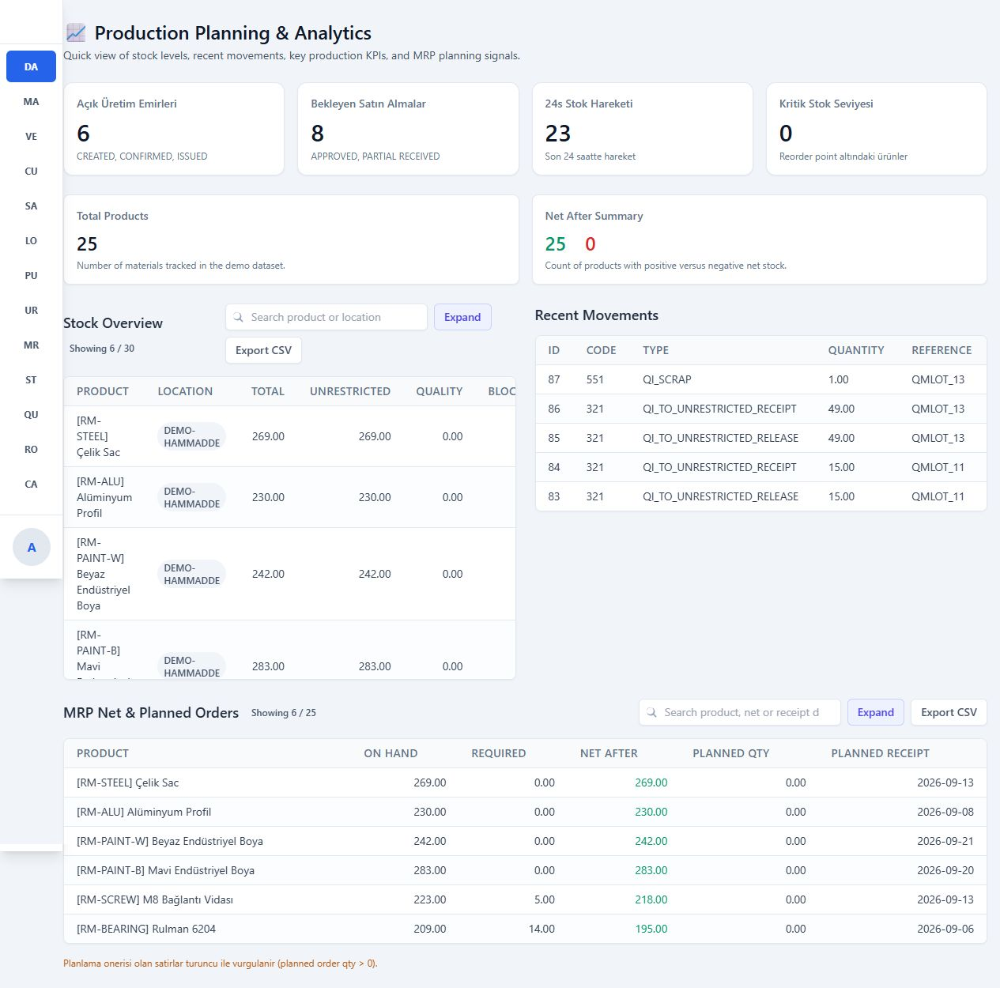
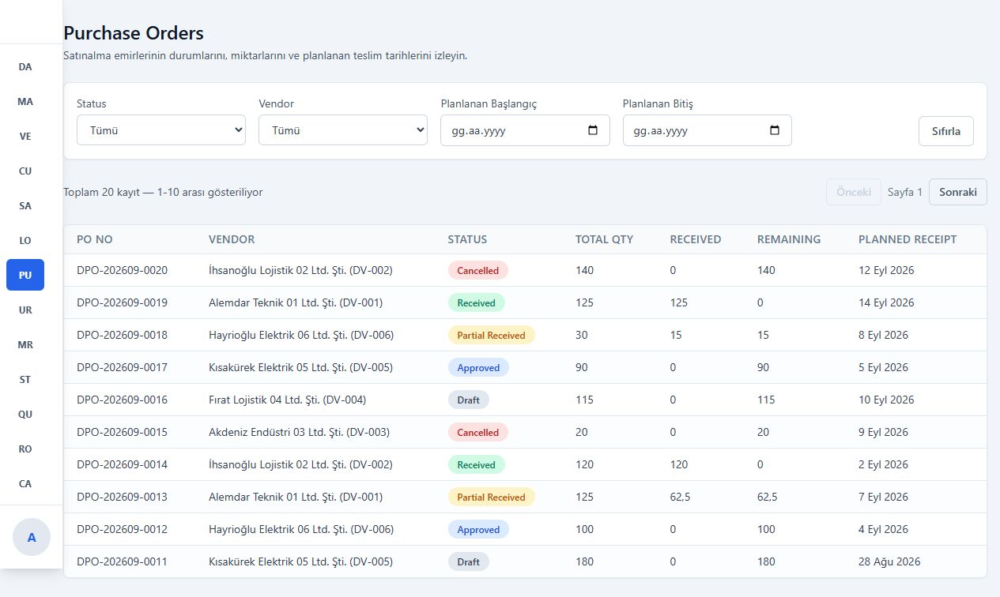
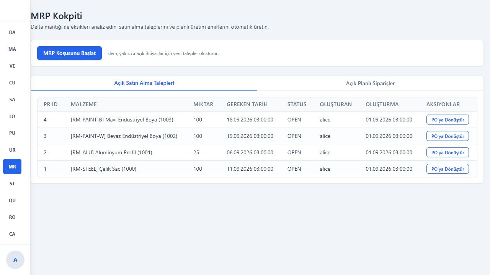
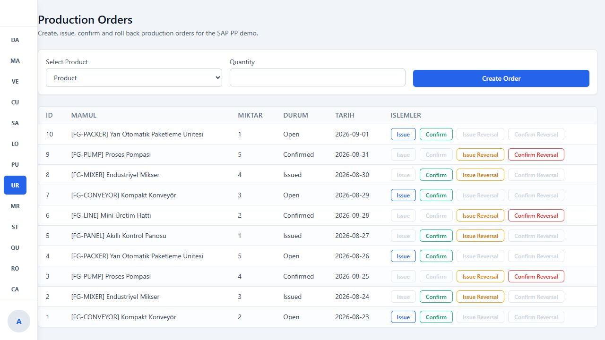
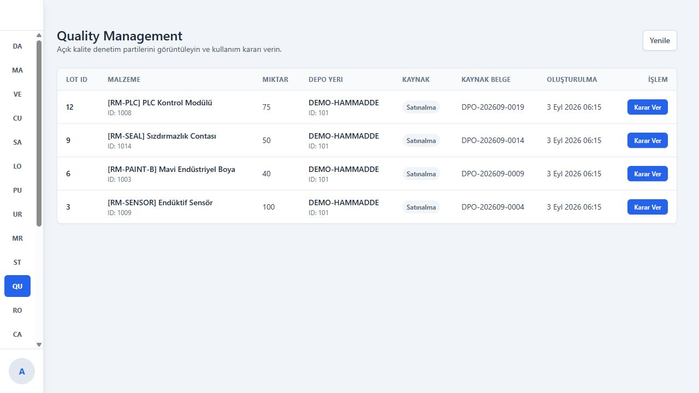
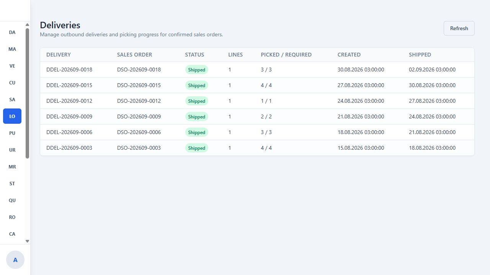
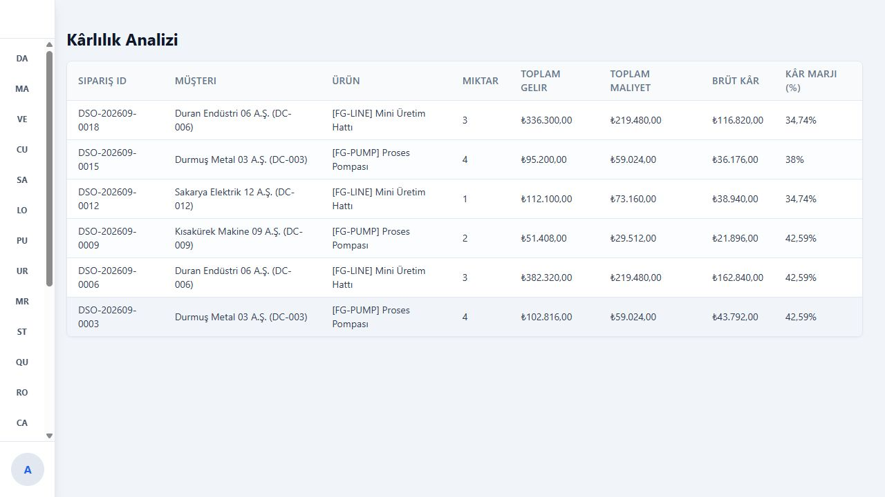

# Modüler ERP Yönetim Sistemi

SAP süreçlerinden esinlenerek geliştirilen; satın alma, üretim, satış, lojistik, finans, maliyet ve kalite süreçlerini tek uygulamada birleştiren tam yığın bir ERP prototipi.

> Bu proje eğitim ve portföy amacıyla geliştirilmiş bir prototiptir. Production ortamında kullanılmak üzere güvenlik ve ölçeklenebilirlik sertleştirmeleri yapılmamıştır.

## İçindekiler

- [Proje hakkında](#proje-hakkında)
- [Ekran görüntüleri](#ekran-görüntüleri)
- [Öne çıkan özellikler](#öne-çıkan-özellikler)
- [Modüller](#modüller)
- [Entegre iş akışları](#entegre-iş-akışları)
- [Teknolojiler](#teknolojiler)
- [Proje yapısı](#proje-yapısı)
- [Kurulum ve çalıştırma](#kurulum-ve-çalıştırma)
- [Demo kullanıcıları](#demo-kullanıcıları)
- [Demo veri üretimi](#demo-veri-üretimi)
- [Test ve kalite kontrolleri](#test-ve-kalite-kontrolleri)
- [Proje durumu](#proje-durumu)

## Proje hakkında

Bu uygulama, bir ERP sistemindeki temel belge ve stok hareketlerini birbirine bağlayan uçtan uca senaryoları göstermek amacıyla geliştirilmiştir. Sistem yalnızca ekranlardan oluşmaz; yapılan operasyonlar stok, muhasebe, maliyet, kalite ve denetim kayıtlarına yansıtılır.

Başlıca hedefler:

- ERP modülleri arasındaki veri akışını modellemek
- Belge yaşam döngülerini ve durum geçişlerini yönetmek
- Stok hareketlerini hareket kodlarıyla izlemek
- Operasyonel işlemlerden otomatik FI/CO kayıtları üretmek
- MRP, batch/FEFO ve kalite yönetimi gibi ileri seviye süreçleri uygulamak
- Rol bazlı ve denetlenebilir bir kullanıcı deneyimi sunmak

## Ekran görüntüleri

### Dashboard



| Satın alma siparişleri | MRP kokpiti |
| --- | --- |
|  |  |

| Üretim emirleri | Kalite yönetimi |
| --- | --- |
|  |  |

| Lojistik | Kârlılık analizi |
| --- | --- |
|  |  |

## Öne çıkan özellikler

- React tabanlı modüler yönetim arayüzü
- Flask REST API ve SQLite veri katmanı
- JWT kimlik doğrulama ve rol bazlı yetkilendirme
- Kullanıcı ve işlem bazlı audit log
- MRP çalıştırma ve satın alma/üretim önerileri
- PR → PO ve planlı sipariş → üretim emri dönüşümü
- BOM, routing, work center ve kapasite planlama
- Lokasyon ve stok tipi bazlı envanter takibi
- Batch yönetimi ve FEFO stok önerisi
- Üç yönlü eşleştirme: PO – mal kabul – fatura
- Otomatik FI/CO yevmiye kayıtları
- Kalite kontrol lotları ve kullanım kararı
- KPI, mizan, maliyet merkezi ve kârlılık raporları

## Modüller

| Modül | Kapsam |
| --- | --- |
| Material Master | Malzeme türü, tedarik tipi, lot büyüklüğü, yeniden sipariş noktası ve standart maliyet |
| MM – Materials Management | Tedarikçiler, satın alma siparişleri, mal kabul, ters kayıt ve fatura kontrolü |
| PP – Production Planning | BOM, üretim emirleri, bileşen tüketimi, üretim teyidi, routing ve kapasite |
| MRP | Net ihtiyaç hesaplama, PR/planlı sipariş üretme ve önerileri gerçek belgelere dönüştürme |
| SD – Sales & Distribution | Müşteriler, satış siparişleri, ATP kontrolü ve stok rezervasyonu |
| LE – Logistics Execution | Delivery, picking, paketleme, batch seçimi ve sevkiyat |
| FI – Financial Accounting | Hesap planı, yevmiye kayıtları, GR/IR ve mizan raporu |
| CO – Controlling | Maliyet merkezleri, ürün maliyetlendirme ve kârlılık analizi |
| QM – Quality Management | Inspection lot, kullanım kararı, serbest/bloke/hurda stok hareketleri |
| Administration | Kullanıcı, rol, yetki ve denetim kayıtları |

## Entegre iş akışları

### Satın almadan ödemeye

```text
Tedarikçi → Satın Alma Siparişi → Onay → Mal Kabul (101)
→ Kalite Kontrolü → Fatura Kontrolü → FI/CO Kaydı
```

- Kısmi ve tam mal kabul desteklenir.
- Fazla mal kabul ve fazla ters kayıt engellenir.
- Mal kabul hareketleri `102` koduyla geri alınabilir.
- PO, mal kabul ve fatura verileri üç yönlü eşleştirilir.
- Uyuşmayan faturalar `BLOCKED` durumuna alınır.

### Üretim süreci

```text
MRP → Planlı Sipariş → Üretim Emri → Bileşen Tüketimi (261)
→ Üretim Teyidi (601) → Mamul Stoğu
```

- Bileşen ihtiyaçları BOM üzerinden hesaplanır.
- Batch yönetimli malzemelerde FEFO önerisi sunulur.
- Üretim hareketleri `262` ve `602` kodlarıyla geri alınabilir.
- BOM ve routing verileri ürün maliyetlendirmesinde kullanılır.

### Siparişten sevkiyata

```text
Müşteri → Satış Siparişi → ATP Kontrolü → Stok Rezervasyonu
→ Delivery → Picking → Sevkiyat (701) → Gelir ve SMM Kaydı
```

- Fiziksel stok ve rezerve stok ayrı takip edilir.
- Picking sırasında FEFO önerisi veya manuel batch seçimi yapılabilir.
- Sevkiyatla birlikte stok, rezervasyon, FI ve CO kayıtları güncellenir.

### Kalite yönetimi

Kalite kontrolü gereken malzemeler mal kabul veya üretim teyidi sonrasında `QUALITY_INSPECTION` stok tipine alınır. Kullanım kararı ile miktar:

- `321` hareketiyle serbest kullanıma,
- `551` hareketiyle hurdaya,
- veya bloke stoğa

aktarılabilir. Hurda kararı ilgili FI/CO kayıtlarını da otomatik oluşturur.

## Teknolojiler

### Frontend

- React 19
- Vite
- React Router
- TanStack Query
- Axios
- Tailwind CSS
- Playwright

### Backend

- Python
- Flask
- Flask-JWT-Extended
- Flask-CORS
- SQLite
- SQL görünümleri ve parametrik sorgular

## Proje yapısı

```text
ERP/
├── backend/
│   ├── app/
│   │   ├── routes/       # REST API uçları
│   │   ├── services/     # İş kuralları ve modül servisleri
│   │   ├── sql/          # Uygulama şemaları ve görünümler
│   │   ├── db.py         # SQLite bağlantısı ve başlangıç işlemleri
│   │   └── main.py       # Flask giriş noktası
│   ├── data/             # Demo SQLite veritabanı
│   ├── sql/              # Modül şemaları ve seed dosyaları
│   └── seed_phase3.py    # Batch/FEFO demo verisi
├── frontend/
│   ├── src/
│   │   ├── components/   # Ortak UI bileşenleri
│   │   ├── context/      # Kimlik doğrulama durumu
│   │   ├── pages/        # ERP modül ekranları
│   │   └── services/     # API istemcileri
│   └── tests/            # Playwright senaryoları
├── docs/                 # Ek dokümantasyon
├── erp_kodlari.md        # Hareket, stok ve belge kodları
└── yapilanlar.md         # Ayrıntılı geliştirme günlüğü
```

## Kurulum ve çalıştırma

### Gereksinimler

- Python 3.10 veya üzeri
- Node.js 20 veya üzeri
- npm

### 1. Backend

```bash
cd backend
python -m venv .venv
```

Sanal ortamı etkinleştirin:

```powershell
# Windows PowerShell
.\.venv\Scripts\Activate.ps1
```

```bash
# macOS / Linux
source .venv/bin/activate
```

Bağımlılıkları yükleyip API’yi başlatın:

```powershell
# Windows PowerShell
pip install -r requirements.txt
$env:JWT_SECRET_KEY = "yerel-gelistirme-icin-uzun-rastgele-bir-deger"
$env:SEED_DEMO_USERS = "1"
python -m app.main
```

```bash
# macOS / Linux
pip install -r requirements.txt
export JWT_SECRET_KEY="yerel-gelistirme-icin-uzun-rastgele-bir-deger"
export SEED_DEMO_USERS="1"
python -m app.main
```

Backend varsayılan olarak `http://localhost:5000` adresinde çalışır. Uygulama başlangıcında gerekli SQLite tabloları ve görünümleri kontrol edilir. Varsayılan veritabanı:

```text
backend/data/sappp.db
```

Backend yapılandırması ortam değişkenleriyle yönetilir:

| Değişken | Varsayılan | Açıklama |
| --- | --- | --- |
| `JWT_SECRET_KEY` | Yok, zorunlu | JWT imzalama anahtarı |
| `ERP_DATABASE_PATH` | `backend/data/sappp.db` | SQLite veritabanı yolu |
| `CORS_ORIGINS` | `http://localhost:5173` | Virgülle ayrılmış izinli frontend adresleri |
| `SEED_DEMO_USERS` | `0` | `1` olduğunda yerel demo kullanıcılarını hazırlar |
| `ALLOW_PUBLIC_REGISTRATION` | `0` | Kontrollü geliştirme ortamında public kaydı etkinleştirir |
| `FLASK_DEBUG` | `0` | `1` olduğunda Flask debug modunu açar |

### 2. Frontend

Yeni bir terminal açın:

```bash
cd frontend
npm install
npm run dev
```

Frontend varsayılan olarak `http://localhost:5173` adresinde açılır ve API isteklerini `http://localhost:5000/api` adresine gönderir.

Farklı bir API adresi kullanmak için `frontend/.env.local` oluşturabilirsiniz:

```env
VITE_API_BASE=http://localhost:5000/api
```

## Demo kullanıcıları

| Kullanıcı | Parola | Rol |
| --- | --- | --- |
| `alice` | `Secret123` | `ADMIN` |
| `bob` | `Another123` | `MM_SPECIALIST` |

Bu hesaplar yalnızca yerel demo içindir ve `SEED_DEMO_USERS=1` olduğunda hazırlanır. Public kayıt varsayılan olarak kapalıdır; yeni kullanıcılar admin panelinden oluşturulabilir. Production ortamında demo kullanıcıları etkinleştirilmemelidir.

## Demo veri üretimi

`backend/seed_demo.py`, Faker'ın Türkçe veri sağlayıcılarını ve kontrollü ERP senaryolarını kullanarak deterministik bir demo veritabanı üretir. Ana `sappp.db` yalnızca şema şablonu olarak okunur; bütün yazımlar ayrı bir staging kopyasında yapılır. Varsayılan davranış, eski Northwind ve tarihsel ERP satırlarını staging kopyasından temizleyerek portföye uygun bağımsız bir veri seti oluşturmaktır.

Showcase verisi üretmek için:

```bash
cd backend
python seed_demo.py --preset showcase --seed 20260902 --as-of 2026-09-01
```

Varsayılan çıktı:

```text
backend/data/demo_erp.db
```

Mevcut demo çıktısını yalnızca doğrulama başarılı olduğunda değiştirmek için `--force` kullanılabilir:

```bash
python seed_demo.py --preset showcase --seed 20260902 --as-of 2026-09-01 --force
```

Daha büyük pagination ve performans verisi için:

```bash
python seed_demo.py --preset load --seed 20260902 --as-of 2026-09-01
```

Şablondaki tarihsel kayıtları özellikle korumak isterseniz:

```bash
python seed_demo.py --preset showcase --keep-template-data
```

Üretilen veritabanıyla backend'i başlatmak için `ERP_DATABASE_PATH` değerini bu dosyaya yönlendirin. Script:

- Türkçe tedarikçi, müşteri ve iletişim bilgileri,
- ROH/HALB/FERT malzemeleri, BOM, routing ve work center kayıtları,
- batch ve FEFO senaryoları,
- farklı durumlarda PO, üretim ve satış siparişleri,
- bloke ve kaydedilmiş faturalar,
- açık/kapanmış kalite lotları ve hurda kararı,
- stok, FI/CO, audit ve kârlılık kayıtları

oluşturur. Aynı template, seed, preset ve `--as-of` değeri aynı veri senaryosunu üretir. Script çıktı yazmadan önce SQLite integrity, foreign key, negatif demo stoğu ve yevmiye dengesi kontrollerini gerçekleştirir.

Northwind material master geçişinden kalan `order_details → products_old` foreign key'i tespit edilirse yalnızca staging kopyasında güncel `products(product_id)` ilişkisine taşınır. Şablon `sappp.db` bu işlem sırasında değiştirilmez.

Doğrulanan `showcase` çıktısı 25 malzeme, 6 tedarikçi, 12 müşteri, 20 satın alma siparişi, 10 üretim emri, 20 satış siparişi, 13 kalite lotu ve 44 dengeli yevmiye kaydı içerir. Bu çıktıda legacy ürün, negatif demo stoğu veya foreign-key hatası bulunmaz.

## Test ve kalite kontrolleri

### Backend regresyon testleri

```bash
cd backend
python -m unittest discover -s tests -p "test_*.py" -v
```

Testler public kayıt, pasif kullanıcı, mevcut token sonrası rol/pasiflik değişiklikleri ve satın alma siparişi temel akışını izole SQLite kopyalarında doğrular.

### Batch/FEFO smoke testi

```bash
cd backend
python test.py
```

Bu senaryo geçici bir SQLite kopyası üzerinde FEFO sıralaması, üretim tüketimi, sevkiyat ve gerçek maliyet FI/CO kayıtlarını doğrular; ana demo veritabanını değiştirmez.

### Frontend lint

```bash
cd frontend
npm run lint
```

### Playwright UI testi

Backend ve frontend çalışırken:

```bash
cd backend
python seed_phase3.py
```

```bash
cd frontend
npx playwright install chromium
npm run test:ui
```

Playwright senaryosu batch yönetimi, FEFO varsayılan seçimi ve manuel batch değiştirme akışını kapsar. Test adresleri ve kullanıcı bilgileri aşağıdaki ortam değişkenleriyle değiştirilebilir:

```env
FRONTEND_BASE_URL=http://localhost:5173
API_BASE_URL=http://localhost:5000/api
E2E_USERNAME=alice
E2E_PASSWORD=Secret123
```

## Proje durumu

Proje aktif olarak geliştirilen bir portföy ve öğrenme çalışmasıdır. Ana modüller ve modüller arası senaryolar uygulanmıştır; ancak production kullanımı öncesinde aşağıdaki çalışmalar gereklidir:

- Modül bazlı okuma yetkilerinin daha ayrıntılı hale getirilmesi
- Rate limiting, parola politikası ve token yenileme akışının eklenmesi
- Otomatik test kapsamının tüm modüllere genişletilmesi
- Kalan büyük route ve React bileşenlerinin daha küçük modüllere ayrılması
- Merkezi hata yönetimi ve API dokümantasyonu
- Docker ve CI/CD kurulumu

## Ayrıntılı geliştirme günlüğü

Modüllerin geliştirme aşamaları, hareket kodları ve doğrulanan senaryolar için [`yapilanlar.md`](./yapilanlar.md) dosyasına bakabilirsiniz.
